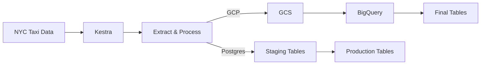

# 🚕 NYC Taxi Data Pipeline

## 📌 Overview

An end-to-end **data engineering pipeline** that ingests NYC Taxi data, processes it, and loads it into **BigQuery (cloud)** or **PostgreSQL (local)** using **Kestra** for orchestration.

Built to demonstrate **production-grade data pipeline practices** like idempotent loads, orchestration, and scalable design.

---

## 🧱 Architecture

---

## ⚙️ Tech Stack

* **Orchestration:** Kestra
* **Cloud:** GCS, BigQuery
* **Database:** PostgreSQL (Docker)
* **Tools:** SQL, YAML, Bash

---

## 🚀 Key Highlights

* **Idempotent pipelines** using `MERGE` (no duplicate data)
* **MD5-based deduplication** for reliable ingestion
* **Supports multiple targets** (BigQuery & PostgreSQL)
* **Parameterized workflows** (taxi type, year, month)
* **Batch + scheduled execution**
* **Infrastructure as code** (GCP resources via workflows)

---

## 🔄 Pipeline Flow

1. Configure environment (KV store)
2. Provision GCP resources
3. Download & extract dataset
4. Load into staging tables
5. Generate unique IDs (MD5)
6. Merge into final tables
7. Cleanup temp data

---

## 🎯 Why This Project

This project mirrors a **real-world data pipeline**:

* Handles raw → clean data transformation
* Ensures safe re-runs (idempotency)
* Uses orchestration for automation
* Supports both cloud and local environments

---

## 🏁 How to Run

* Set config via Kestra KV store
* Run setup workflow
* Execute pipeline with:

  * Taxi type (`yellow` / `green`)
  * Year (`2019–2020`)
  * Month (`01–12`)

---

## 📈 Possible Next Steps

* Add data quality checks
* Optimize BigQuery (partitioning)
* Add dashboards
